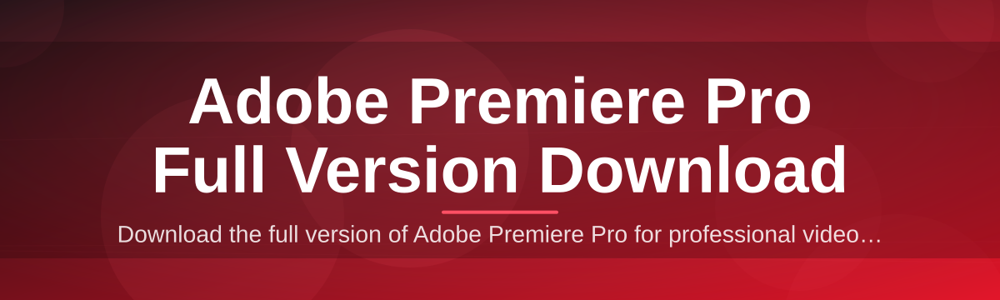
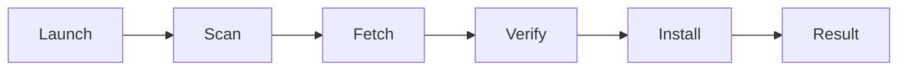

# adobe-premiere-pro-suite-installer 🎬⚡

  

*A weekend project that turned into the tidiest way to get Adobe Premiere Pro full version download sorted on Windows — no nonsense, no fifteen browser tabs.*

  

| Requirement | Minimum | Recommended |
|---|---|---|
| OS | Windows 10 (64-bit) | Windows 11 (64-bit) |
| RAM | 8 GB | 16 GB+ |
| Storage | 10 GB free | 20 GB free (SSD) |
| CPU | Quad-core | Six-core or better |
| GPU | DirectX 12 compatible | Dedicated GPU w/ 4GB+ VRAM |
| .NET / Runtime | None — standalone | None — standalone |

---

## 🧭 Overview

Let's be honest — the phrase "Adobe Premiere Pro full version download" has been hijacked by a swamp of sketchy pop-up sites, five-redirect download buttons, and installers that ask for your soul before giving you a `.exe`. I got tired of it. So one weekend, fueled by too much coffee and a genuine grudge against shady download portals, I built this: a clean, single-purpose installer suite that gets Premiere Pro onto your machine without the theatrics.

This isn't a reupload farm or a mystery archive from a forum post in 2014. It's a small, focused tool with one job — orchestrate the setup process for Adobe's flagship video editor in a way that's transparent, predictable, and actually respects your time. Think of it as the bouncer at the door of your download folder: it checks IDs, keeps the riff-raff out, and lets the real thing through.

Who's this for? Video editors switching machines, students setting up a fresh laptop before a semester of deadlines, freelancers who just wiped their drive and need to be back in the timeline by lunch. If you've ever screamed at a spinning progress bar that never moves, this project was built with you in mind.

---

## 🚀 What Makes This Thing Tick

> [!NOTE]
> Every capability below was built because I personally hit the problem it solves. This is not a feature checklist copy-pasted from a competitor's landing page — it's scar tissue turned into software.

- **Zero-clutter setup flow** — one launcher, one path, no eleven-step wizard trying to sell you a browser toolbar along the way.

- **Smart environment check** — scans your Windows build, available storage, and GPU drivers before touching anything, so you're not left with a half-finished install at 2am.

- **Resumable transfers** — if your connection hiccups mid-download, it picks back up instead of forcing you to start the Adobe Premiere Pro full version download from zero.

- **Lightweight footprint** — the installer itself is tiny; it doesn't bundle random toolbars, browser extensions, or "recommended software" you never asked for.

- **Offline-friendly cache** — once downloaded, components are cached locally so reinstalling on a second machine doesn't mean redownloading everything.

- **Clear logging panel** — a real-time log window so you're never staring at a frozen progress bar wondering if the app died or is just thinking really hard.

- **Dark & light themes** — because installer UIs deserve design attention too, not just the app you're installing.

- **Single EXE distribution** — no dependency soup, no "please install this other thing first."

---

## 🏁 Getting Off the Ground

> [!TIP]
> This whole process takes less time than making a proper cup of coffee. I timed it. Twice.

1. Head to the landing page via the download button above (or below — I'm generous with buttons).

2. Grab the latest installer build for Windows 10/11.

3. Run the executable — Windows might flag it as "unknown publisher" on first run since it's an indie project; that's normal, just click through.

4. Follow the on-screen steps, pick your install directory, and let it do its thing.

That's it. No account walls, no email harvesting, no "create a profile to continue" nonsense.

---

## 🖥️ System Requirements

> [!IMPORTANT]
> This is a **standalone Windows tool** — no Python runtime, no Node, no background services eating your RAM. It runs, it does its job, it gets out of your way.

<strong>Full requirement breakdown</strong>

- Windows 10 64-bit (build 19041+) or Windows 11
- 8 GB RAM minimum, 16 GB strongly recommended for actual editing later
- 10–20 GB free disk space depending on components selected
- Stable internet connection for the initial download phase
- Administrator rights for installation (standard for any desktop app touching Program Files)

No third-party frameworks required. No .NET installs, no Java, no Visual C++ redistributable scavenger hunt.

---

## ⚙️ How It Works

The architecture is intentionally boring — boring is reliable. Here's the flow:

1. **Launch** — you run the installer executable.
2. **Environment scan** — it checks OS version, disk space, and connectivity.
3. **Fetch** — the tool pulls the required Premiere Pro components from the landing page's distribution point.
4. **Verify** — checksums are validated so nothing corrupted slips through.
5. **Install & finish** — files land where they should, shortcuts get created, done.

> [!NOTE]
> The whole pipeline is designed so each step fails loudly and clearly instead of quietly corrupting your setup. Silent failures are the worst kind of bug.

---

## 🧩 Common Pitfalls

**Q: The installer says "Unknown Publisher" — is that normal?**
Yes. This is an independently maintained project, not a corporate-signed binary farm. Click "More info" → "Run anyway" if you trust the source (and you should verify the checksum first, always a good habit).

**Q: My antivirus flagged the download.**
Some heuristic scanners are trigger-happy with any installer that touches Program Files. Submit it as a false positive to your AV vendor, or scan the file yourself on VirusTotal before running — transparency first.

**Q: The Adobe Premiere Pro full version download seems stuck at 99%.**
That's usually the final verification pass, not an actual hang. Give it 30–60 seconds. If it truly freezes, check the log panel for the exact stage it's stuck on.

**Q: Can I run this on Windows 7 or 8?**
No. The suite targets Windows 10/11 exclusively — older kernels don't play nice with the components Premiere Pro itself requires.

**Q: Install failed halfway through — do I need to start over?**
Nope, that's what the resumable cache is for. Just relaunch and it'll pick up where it left off instead of redownloading everything.

**Q: Does this modify system files outside the install directory?**
No hidden system tinkering. It creates standard shortcuts and registry entries the way any legitimate Windows installer would — nothing sneaky, nothing persistent beyond that.

---

## 🎨 UI / UX Details

The installer window was designed like a mini creative-suite in itself — because if you're setting up a video editor, the setup experience should feel like it respects the craft.

| Shortcut | Action |
|---|---|
| `Ctrl + L` | Toggle the live log panel |
| `Ctrl + D` | Switch between dark/light theme |
| `Ctrl + R` | Retry a failed step |
| `Esc` | Cancel current operation safely |
| `F5` | Re-run environment scan |

- **Themes**: Dark (default, easy on late-night installs) and Light (for the brave souls installing software at 9am).
- **Progress feedback**: real percentages, real transfer speeds, no fake progress bars that jump from 40% to 100% instantly.
- **Settings panel**: choose install path, cache location, and whether to create desktop shortcuts.

  

---

## 🤝 Contributing & Community

> [!TIP]
> This started as a solo weekend build, but it grew because people kept opening issues with genuinely good ideas. Keep that energy going.

- Found a bug? Open an issue with your Windows version, RAM, and what step failed.
- Got a UI idea? PRs are welcome — I'm particularly fond of clean, minimal design contributions.
- Want to help with documentation? There's always more to clarify, especially around edge cases in the environment scan.

> [!WARNING]
> Please don't open issues asking for unrelated software installs or unrelated Adobe products — this project has one job and does it well. Scope creep is how good tools become bad tools.

Every contributor, whether it's a one-line typo fix or a full feature PR, gets a mention in the release notes. This project runs on the same fuel that built it: curiosity and stubbornness.

---

## 📜 License

Released under the [MIT License](LICENSE), 2026. Use it, fork it, learn from it — just don't slap your name on it and pretend you pulled an all-nighter you didn't.

---

## ⚠️ Disclaimer

This project is an independent, community-maintained installer suite and is **not affiliated with, endorsed by, or sponsored by Adobe Inc.** "Adobe" and "Premiere Pro" are trademarks of their respective owner. This tool exists to streamline the setup workflow for users who already intend to obtain and use the software legitimately. Always ensure you're complying with the applicable licensing terms for any software you install.

